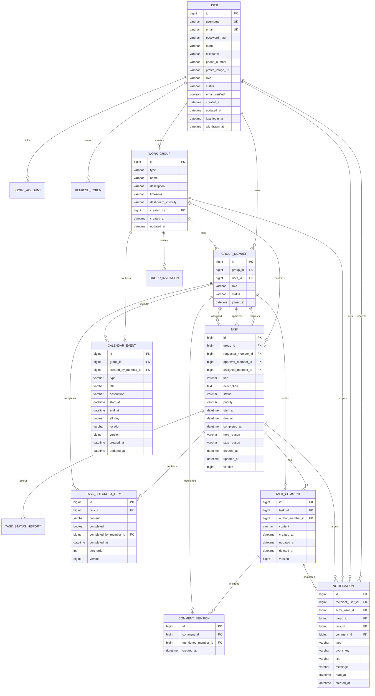

# 초기 ERD와 데이터 기준선

상태: Flyway V1~V12 로컬 알파 구현 기준

## 관계도

## 현재 인증 테이블

| 테이블 | 책임 | 핵심 제약 |
|---|---|---|
| `users` | 계정과 시스템 권한 | username/email 각각 unique |
| `social_accounts` | OAuth 제공자 계정 연결 | provider + provider_subject unique |
| `one_time_tokens` | 가입 인증·비밀번호 복구 | 토큰 원문 미저장, hash와 만료/사용 시각 저장 |
| `refresh_tokens` | 회전식 로그인 세션 | token_hash unique, 폐기 시각 저장 |

DB의 기존 `users.role`과 JWT `role` claim은 호환성을 위해 유지하고, Java 도메인 필드는 `systemRole`로 구분한다. `V2__extend_user_profile.sql`이 프로필 필드와 계정 상태를 추가한다.

## Phase 1 사용자 구현 기준

`users`에 `nickname`, `phone_number`, `profile_image_url`, `status`, `updated_at`, `withdrawn_at`을 적용했다. 이메일·전화번호 공개 범위는 User 전체를 응답하지 않고 목적별 DTO로 제한한다.

계정 상태 후보:

- `ACTIVE`: 정상
- `SUSPENDED`: 로그인·토큰 재발급 차단
- `WITHDRAWN`: 로그인 차단, 개인정보 익명화 완료

## Phase 2 그룹 구현 기준

### work_groups (`Group` 엔티티)

- `type`: `PERSONAL`, `TEAM`
- `name`: 표시용, 전체 서비스에서 중복 허용
- `timezone`: 기본 `Asia/Seoul`
- `dashboard_visibility`: `LEADER_ONLY`, `MEMBERS`
- PERSONAL 그룹은 사용자당 정확히 하나여야 한다.

### group_members

- unique `(group_id, user_id)`
- `role`: `LEADER`, `MEMBER`
- `status`: `ACTIVE`, `LEFT`, `REMOVED`
- 탈퇴 이력 때문에 행을 물리 삭제하지 않는다.
- PERSONAL 그룹에는 정확히 한 명의 ACTIVE LEADER만 존재한다.

### group_invitations (Flyway V5 구현)

- `group_id`, 초대 대상 `email`, `invited_by_member_id`
- `token_hash`, `status`, `expires_at`, `accepted_at`, `created_at`
- 초대 원문 토큰은 저장하지 않는다.

MySQL의 부분 unique index 제약 때문에 “사용자당 PERSONAL 하나”, “그룹에 ACTIVE LEADER 한 명 이상”은 트랜잭션 서비스 검증과 통합 테스트로 함께 보장한다.

## Phase 3 업무 구현 기준 (Flyway V6)

### tasks

- `group_id`, `requester_member_id`, 선택 `approver_member_id`, `assignee_member_id`
- `status`: `REQUESTED`, `TODO`, `IN_PROGRESS`, `ON_HOLD`, `COMPLETED`, `REJECTED`, `CANCELLED`
- `priority`: `LOW`, `NORMAL`, `HIGH`, `URGENT`
- `start_at`, `due_at`, `completed_at`, `hold_reason`, `stop_reason`, `created_at`, `updated_at`
- `version`: 낙관적 잠금
- 지연 여부는 저장하지 않고 `due_at < now && status not in (COMPLETED, REJECTED, CANCELLED)`로 계산한다.

### task_status_histories

- `task_id`, 이전/다음 상태, 변경자 member_id, 사유, 변경 시각
- 상태 이력은 알림·리포트·감사 근거이므로 물리 삭제하지 않는다.
- 업무 생성 시 `from_status = null`인 최초 이력을 함께 저장한다.

## Phase 4 체크리스트 구현 기준 (Flyway V7)

### task_checklist_items

- `task_id`, `content`, `completed`, `sort_order`, `created_at`, `updated_at`
- 완료 시 `completed_by_member_id`, `completed_at`을 기록하고 미완료 전환 시 비운다.
- `version`으로 수정·완료·삭제의 오래된 요청을 차단한다.
- 진행률은 저장하지 않고 완료 항목 수와 전체 항목 수로 계산한다. 항목이 없으면 진행률은 `null`이다.
- 업무별 목록은 `(task_id, sort_order, id)` 순서로 안정적으로 조회한다.

## Phase 4 댓글 구현 기준 (Flyway V8)

### task_comments

- `task_id`, `author_member_id`, `content`, `created_at`, 선택 `updated_at`, `deleted_at`
- `version`으로 수정·삭제의 오래된 요청을 차단한다.
- 삭제는 행을 제거하지 않고 `deleted_at`을 기록하며 외부 응답에서 원문을 마스킹한다.
- 업무별 목록은 `(task_id, created_at, id)` 순서로 안정적으로 조회한다.

## Phase 4 멘션 구현 기준 (Flyway V9)

### comment_mentions

- `comment_id`, `mentioned_member_id`, `created_at`
- unique `(comment_id, mentioned_member_id)`로 같은 댓글의 중복 멘션을 차단한다.
- 멘션 대상은 댓글 업무와 같은 그룹의 ACTIVE 멤버만 허용한다.
- 알림 수신자 조회를 위해 `(mentioned_member_id, created_at, id)` 인덱스를 둔다.

## Phase 4 알림 구현 기준 (Flyway V10)

### notifications

- 알림은 멤버십이 아니라 `recipient_user_id`에 귀속해 그룹 접근 권한을 잃은 뒤에도 수신자 본인이 읽음 처리할 수 있다.
- 선택 `actor_user_id`, `group_id`, `task_id`, `comment_id`와 표시용 제목·메시지 스냅샷을 저장한다.
- `type`은 `TASK_REQUESTED`, `TASK_ASSIGNED`, `TASK_STATUS_CHANGED`, `COMMENT_CREATED`, `COMMENT_MENTIONED`다.
- unique `(recipient_user_id, event_key)`와 application 계층의 사용자 ID 중복 제거를 함께 적용한다.
- 목록은 `(recipient_user_id, id)`의 최신순 커서 페이지, 미확인은 `(recipient_user_id, read_at, id)`로 조회한다.

## Phase 5 캘린더 구현 기준 (Flyway V11)

### calendar_events

- `group_id`, `created_by_member_id`, `type`, 제목·설명, 선택 장소와 종일 여부를 저장한다.
- `start_at`, `end_at`은 그룹 timezone의 현지 입력을 UTC `DATETIME(6)` 값으로 변환해 저장한다.
- DST로 존재하지 않거나 두 번 존재하는 현지 시각은 명시적인 `CALENDAR_LOCAL_TIME_INVALID`로 거부한다.
- `version`으로 수정·삭제의 오래된 요청을 차단한다.
- 업무 마감은 이 테이블에 복제하지 않고 `tasks.due_at`을 조회 시 `TASK_DEADLINE` 항목으로 합성한다.
- 기간 겹침 조회를 위해 `(group_id, start_at, end_at, id)` 인덱스를 둔다.

## 식별자와 참조 규칙

- 저장 경로·URL에는 변경 가능한 그룹명·닉네임 대신 ID를 사용한다.
- 그룹 소속 자원은 반드시 `group_id`를 가진다.
- 업무 담당자는 그룹 내부 역할과 탈퇴 이력을 추적할 수 있도록 `group_member_id`를 참조한다.
- 외부 응답은 필요한 ID만 노출하며 Entity를 그대로 직렬화하지 않는다.
- 새 캘린더 일정은 UTC로 저장하고 사용자/그룹 timezone으로 표시한다. 기존 `tasks.due_at` 현지 시각 계약은 캘린더 합성 시 그룹 timezone으로 해석한다.

## 초기 인덱스

- `users(username)`, `users(email)` unique
- `social_accounts(provider, provider_subject)` unique
- `refresh_tokens(token_hash)` unique
- `group_members(group_id, user_id)` unique
- `group_members(user_id, status)`
- `tasks(group_id, status, due_at)`
- `tasks(assignee_member_id, status, due_at)`
- `task_status_histories(task_id, created_at)`
- `task_checklist_items(task_id, sort_order, id)`
- `task_comments(task_id, created_at, id)`
- `comment_mentions(comment_id, mentioned_member_id)` unique
- `comment_mentions(mentioned_member_id, created_at, id)`
- `notifications(recipient_user_id, event_key)` unique
- `notifications(recipient_user_id, id)`
- `notifications(recipient_user_id, read_at, id)`
- `calendar_events(group_id, start_at, end_at, id)`
- `tasks(group_id, created_at, id)` (Flyway V12, 그룹 대시보드 최신순 집계 기준선)

실제 인덱스는 대표 쿼리의 실행 계획을 확인한 뒤 추가하며, 상태 값만 단독 인덱스로 만들지 않는다.
